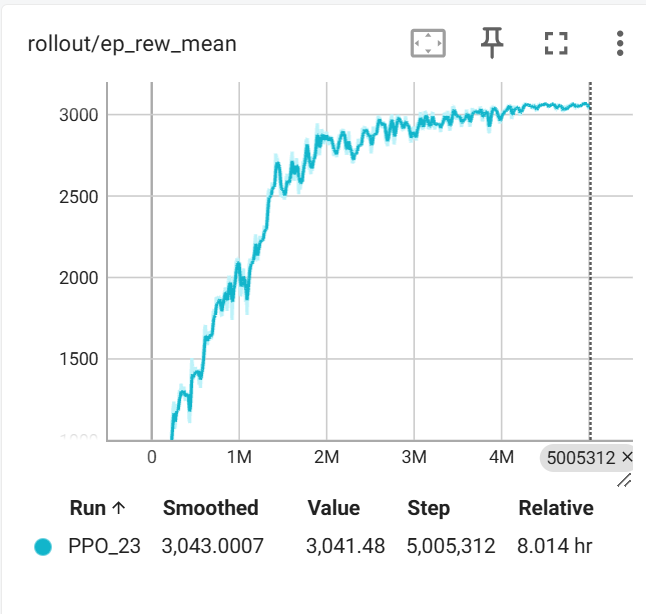
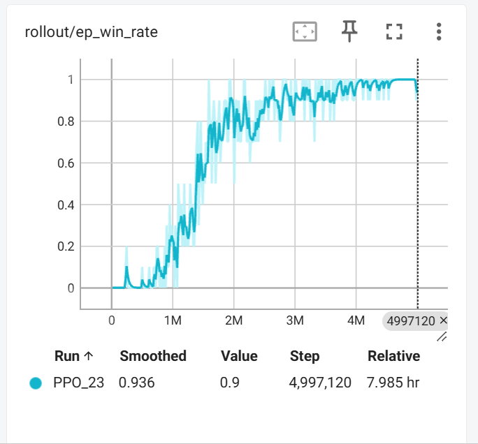
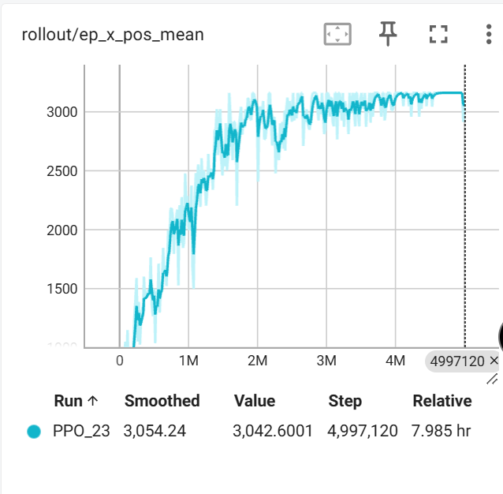
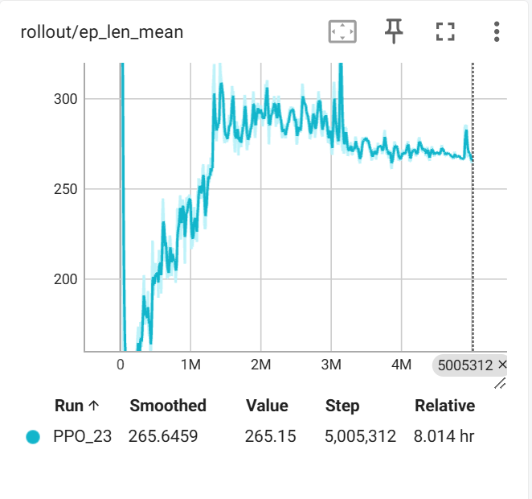
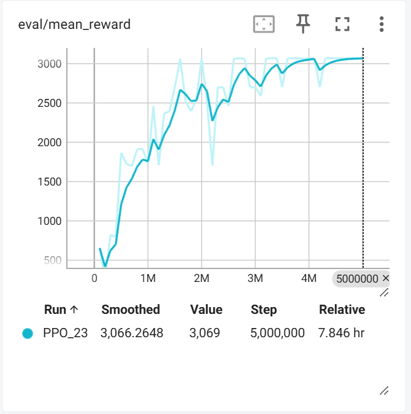
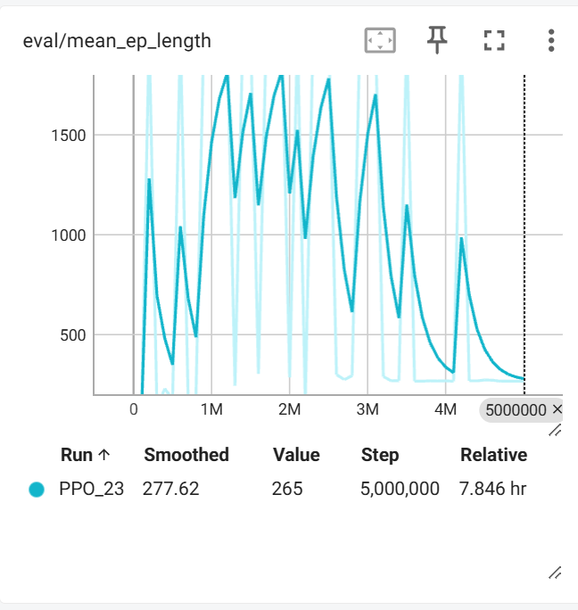

# 基于强化学习的 AI 玩转马里奥

使用 PPO + CNN 训练 AI 自主通关《超级马里奥》1-1 关。基于 gym-super-mario-bros 环境，适配低算力设备（笔记本/RTX 5060），优先保证流程跑通和学习效果可见。

## 技术栈

| 组件 | 版本 | 说明 |
|------|------|------|
| Python | 3.10 | 兼顾老 gym 与新 torch |
| PyTorch | 2.11.0+cu128 | RTX 5060 (Blackwell sm_120) 必需 |
| gym | 0.21.0 | 路线 A（经典稳定） |
| gym-super-mario-bros | 7.4.0 | 马里奥环境 |
| stable-baselines3 | 1.8.0 | PPO 实现 |
| numpy | 1.26.4 | 必须 <2.0 |
| opencv | 4.10.0.84 | 图像预处理 |

## 环境搭建

### 1. 创建 conda 环境

```bash
conda create -n mario-rl python=3.10 -y
conda activate mario-rl
```

### 2. 降级工具链（gym 0.21 必需）

```bash
pip install pip==23.3.2 setuptools==65.7.0 wheel==0.38.4
```

> **为什么降级**：gym 0.21.0 的 setup.py 包含无效版本说明符（`opencv-python>=3.`），pip≥24.1 会直接拒绝；setuptools≥66 构建时也会报错。

### 3. 安装 PyTorch（CUDA 12.8，支持 RTX 50 系列）

```bash
pip install torch torchvision --index-url https://download.pytorch.org/whl/cu128
```

### 4. 安装项目依赖

```bash
pip install -r requirements.txt
```

> **注意**：`requirements.txt` 中的 `--extra-index-url` 指向 PyTorch cu128 源。若已单独安装 torch，可忽略该行。

### 5. 验证环境

```bash
python verify_env.py
```

预期输出：所有包导入正常，环境创建成功，随机策略 50 步闭环无异常。

## 快速开始

### 训练

```bash
# 默认训练（4环境并行 + 奖励归一化，100 万步）
python -m mario_rl.train

# 自定义参数
python -m mario_rl.train --total-timesteps 500000 --n-steps 512 --batch-size 32

# 调整并行环境数（默认4，可试8）
python -m mario_rl.train --n-envs 8

# 使用自定义轻量 CNN（更低算力）
python -m mario_rl.train --custom-cnn

# 开启奖励塑形（时间惩罚 + 跳跃惩罚，解决"一直跳掉坑里"）
python -m mario_rl.train --shaping

# 跳跃惩罚（每次跳扣奖励，默认0.02，建议0.01~0.05）
python -m mario_rl.train --shaping --jump-penalty 0.02

# 时间惩罚（每步扣奖励，默认0.01）
python -m mario_rl.train --shaping --time-penalty 0.01

# 熵系数（越大越鼓励探索，默认0.01，策略坍缩时可升到0.05）
python -m mario_rl.train --ent-coef 0.05

# 自适应熵系数（推荐：熵过低时自动升高防坍缩，熵过高时自动降低促收敛）
python -m mario_rl.train --adaptive-entropy --lr-schedule linear --total-timesteps 5000000

# 自定义自适应熵参数（目标熵1.0，允许波动范围±0.3）
python -m mario_rl.train --adaptive-entropy --target-entropy 1.0 --entropy-band 0.3

# 推荐组合：塑形 + 跳跃惩罚 + 高熵系数，解决策略坍缩
python -m mario_rl.train --shaping --jump-penalty 0.02 --ent-coef 0.05 --total-timesteps 500000

# 线性衰减学习率（推荐，后期精细调优，避免策略震荡）
python -m mario_rl.train --lr-schedule linear --total-timesteps 1000000

# 从已有 checkpoint 微调（低学习率 + 线性衰减）
python -m mario_rl.train --load-model checkpoints/mario_ppo_800000_steps.zip --learning-rate 1e-4 --lr-schedule linear --total-timesteps 200000

# 关闭奖励归一化（默认开启，解决马里奥奖励尺度过大问题）
python -m mario_rl.train --no-norm-reward

# 训练时实时渲染游戏画面（弹窗显示，会拖慢训练）
python -m mario_rl.train --render

# 渲染频率控制（每N步渲染一帧，默认4；越小越流畅但越慢）
python -m mario_rl.train --render --render-freq 8
```

模型 checkpoint 保存在 `checkpoints/`，TensorBoard 日志在 `logs/`。

**checkpoints 目录文件说明**：
- `mario_ppo_{N}_steps.zip`：第 N 步的模型权重
- `mario_ppo_vecnormalize_{N}_steps.pkl`：对应模型的 VecNormalize 统计信息（奖励 running mean/std），微调时自动加载
- `mario_ppo_final.zip`：训练结束时的最终模型
- `vecnormalize.pkl`：旧版训练结束时的统计信息（兼容格式）
- `best/best_model.zip`：EvalCallback 保存的最佳模型

> **实时渲染说明**：`--render` 开启后训练时会弹出游戏窗口，显示第一个环境的实时画面。渲染会拖慢训练速度（fps 下降约 30-50%），建议先不开渲染训练，想看效果时用 `watch` 或 `evaluate --render`。渲染窗口需要桌面环境，无头服务器无法使用。

### 训练进度与指标

训练时终端会实时输出两类信息：

**1. 每 2000 步一次的进度条（ProgressCallback）：**
```
[进度]  50,000/500,000 (10.0%) | 已用: 5.2min | 剩余: 47min | fps: 160 | 均奖励: 850, 均x_pos: 1200, 通关率: 5%
```
- `均x_pos`：最近 10 局平均前进距离，最直观的进步信号
- `通关率`：最近 10 局通关比例
- `预计剩余`：基于当前 fps 估算的剩余训练时间

**2. 每 4096 步（一次 PPO 更新）一次的详细指标：**
```
| rollout/     |             |
|  ep_len_mean | 340         |  平均每局步数
|  ep_rew_mean | 866         |  平均每局奖励
|  ep_x_pos_mean | 1163      |  平均每局前进距离（新增）
|  ep_win_rate | 0.1         |  通关率（新增）
| train/       |             |
|  approx_kl   | 0.01        |  策略更新幅度（正常0.001~0.05）
|  entropy     | 1.87        |  探索程度（太低说明策略坍缩）
|  explained_variance | 0.75 |  值函数质量（应从0升到0.5+）
|  value_loss  | 0.096       |  值函数损失（应逐渐下降）
```

**查看 TensorBoard 完整曲线：**
```bash
tensorboard --logdir logs
```
浏览器打开 `http://localhost:6006`，可查看 20+ 项指标的完整曲线。

**判断训练是否正常的关键指标：**
| 指标 | 正常表现 | 异常信号 |
|---|---|---|
| `ep_x_pos_mean` | 持续上升 | 长期停滞不涨 |
| `ep_rew_mean` | 波动上升 | 连续5万步下降 |
| `explained_variance` | 从0升到0.5+ | 长期为负或接近0 |
| `entropy` | 从~1.9缓慢下降 | 快速降到0.5以下（坍缩） |
| `approx_kl` | 0.001~0.05 | 接近0（不更新）或>0.1（不稳定） |

### 评估 / 推理演示

```bash
python -m mario_rl.evaluate --model checkpoints/mario_ppo_final.zip --episodes 5
```

### 全管线验证（环境→PPO→短训练→保存加载→推理）

```bash
python verify_pipeline.py
```

## 可视化：看 AI 实际玩游戏

不只是曲线，可以实时看到 AI 玩游戏的画面，也可以录制视频。

### 评估时渲染 + 录屏

```bash
# 实时渲染看 AI 玩
python -m mario_rl.evaluate --model checkpoints/mario_ppo_final.zip --render --episodes 3

# 渲染 + 录制视频（保存到 videos/）
python -m mario_rl.evaluate --model checkpoints/mario_ppo_final.zip --render --record --episodes 3

# 慢放（0.5 倍速，看清动作细节）
python -m mario_rl.evaluate --model xxx.zip --render --speed 0.5
```

### 训练时实时观看（watch 模式）

训练在后台跑的同时，用 watch 模式实时看最新效果：

```bash
# 自动加载 checkpoints/ 下最新模型，无限玩（Ctrl+C 退出）
python -m mario_rl.watch

# 指定模型
python -m mario_rl.watch --model checkpoints/mario_ppo_final.zip

# 玩 10 局并录屏
python -m mario_rl.watch --episodes 10 --record

# 慢放
python -m mario_rl.watch --speed 0.5

# 关闭自动刷新（默认每局结束检查新 checkpoint 并自动加载）
python -m mario_rl.watch --no-auto-reload

# 使用确定性策略（默认随机策略，每局不同；想看最优/最稳定表现加这个）
python -m mario_rl.watch --deterministic
```

**watch 模式说明**：
- 默认使用**随机策略**（从策略分布中采样），每局表现不同，能看到模型的真实能力范围
- 加 `--deterministic` 使用贪心策略（选概率最高的动作），每局表现相同，适合看最优表现
- 自动刷新按**文件修改时间**查找最新模型，不是按步数
- 训练时 `CheckpointCallback` 每 5 万步保存新模型，watch 每局结束后自动检测并加载

### 视频输出

录制的视频保存在 `videos/` 目录，文件名包含局数、奖励和时间戳，例如：
- `eval_ep1_reward150_20260901_193000.mp4`
- `watch_ep3_reward892_20260901_193500.mp4`

## 项目结构

```
mario-rl/
├── mario_rl/                  # 核心包
│   ├── config.py              # 全局配置（环境/PPO/模型/训练/路径）
│   ├── env_wrappers.py        # 环境 Wrapper 管线
│   ├── model.py               # CNN 策略网络
│   ├── train.py               # 训练入口（4环境+奖励归一化+实时渲染+进度回调）
│   ├── evaluate.py            # 评估/推理演示（渲染+录屏）
│   ├── watch.py               # 训练时实时观看（自动刷新最新checkpoint）
│   ├── utils.py               # 工具函数
│   └── tests/
│       └── test_wrappers.py   # 单元测试（12 项）
├── docs/
│   └── phase1-requirements-and-selection.md  # 阶段一：需求与技术选型
├── checkpoints/                # 模型保存
├── logs/                       # TensorBoard 日志
├── videos/                     # 录屏
├── DESIGN.md                   # 阶段三：设计文档
├── requirements.txt            # 锁定依赖版本
├── verify_env.py               # 阶段二：环境验证
├── verify_pipeline.py          # 阶段三：全管线验证
└── README.md                   # 本文档
```

## 环境 Wrapper 管线

```
原始帧 (240,256,3) uint8
  → SkipFrame(4)               每 4 帧执行一次动作
  → GrayScaleObservation        RGB → 灰度 (240,256)
  → ResizeObservation(84)       缩放 (84,84)
  → [可选] RewardShaping         时间惩罚 + 跳跃惩罚（--shaping 开启）
  → FrameStack(4)               堆叠 4 帧 (4,84,84)
  → NormalizeObservation         像素 /255 → (4,84,84) float32 [0,1]
  → Monitor                      记录 episode 奖励/长度/x_pos/通关率
  → [训练时] VecNormalize        奖励归一化（norm_obs=False, norm_reward=True）
```

最终观测空间 `(4, 84, 84) float32`，符合 SB3 `CnnPolicy` 的 CHW 格式。

> **注意**：VecNormalize 只在训练时包装环境，评估/推理时不需要（因为只归一化奖励，不影响观测和动作选择）。

## 运行单元测试

```bash
python -m pytest mario_rl/tests/ -v
```

## 阶段进度

- [x] 阶段一：需求分析与技术选型 → `docs/phase1-requirements-and-selection.md`
- [x] 阶段二：环境搭建 → `requirements.txt` + `verify_env.py`
- [x] 阶段三：结构化设计 → `DESIGN.md` + 完整代码骨架
- [x] 阶段四：迭代开发（4/8环境+奖励归一化+实时渲染+跳跃惩罚+x_pos指标+微调+学习率调度+自适应熵，500万步通关率90%/评估100%）
- [ ] 阶段五：集成测试与优化
- [ ] 阶段六：打包部署与文档
- [ ] 阶段七：持续维护与迭代

## 训练成果

| 指标 | 500 万步模型（最终） |
|---|---|
| 通关率（训练） | 90% |
| 通关率（评估5局） | **100%**（奖励±0.00，每局路径完全一致） |
| 平均 x_pos | 3043 / 3161（96%） |
| 平均奖励 | 3040（训练）/ 3069（评估） |
| 平均每局步数 | 265 |
| entropy | 0.75（稳定在自适应熵目标范围下限） |
| explained_variance | 0.999 |
| approx_kl | 4.2e-6（几乎为0，完全收敛） |
| clip_fraction | 0 |
| 训练速度 | ~170 fps（8环境，RTX 5060） |
| 训练时长 | 约 8 小时（480分钟） |

### 训练曲线（TensorBoard，PPO_23，500万步）

**训练时性能指标**：



*rollout/ep_rew_mean：平均奖励从 ~1100 稳步上升到 ~3040，250万步后进入平台期*



*rollout/ep_win_rate：通关率从 0 上升到 90%，150万步开始快速提升，300万步后稳定在 90%+*



*rollout/ep_x_pos_mean：平均前进距离从 ~1200 上升到 ~3042（关卡总长3161的96%），200万步后进入平台期*



*rollout/ep_len_mean：平均每局步数从 ~170 上升到 ~265，100万步后稳定，说明模型学会了走完全程*

**评估时性能指标**（每10万步评估5局）：



*eval/mean_reward：评估奖励从 ~500 上升到 3069，300万步后稳定在 3000+*



*eval/mean_ep_length：评估每局步数从剧烈波动（早期有时卡死超时）到稳定在 265 步，说明策略完全确定*

**推荐训练命令**（复现上述结果）：
```bash
python -m mario_rl.train --adaptive-entropy --lr-schedule linear --n-envs 8 --total-timesteps 5000000
```

## 已知坑点

详见 `DESIGN.md` 第 6 节"关键踩坑记录"。核心三点：

1. **归一化必须在 FrameStack 之后**，否则 dtype 不一致导致观测全黑
2. **PPO 必须传 `normalize_images=False`**，因为 Wrapper 已归一化
3. **推理时 action 需转 `int()`**，`model.predict` 返回 ndarray
